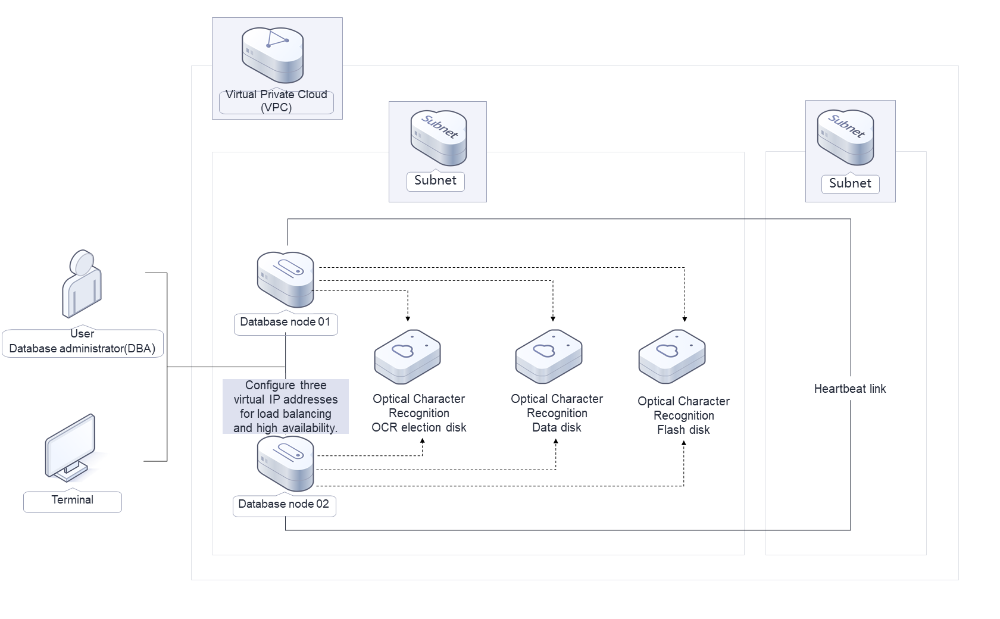
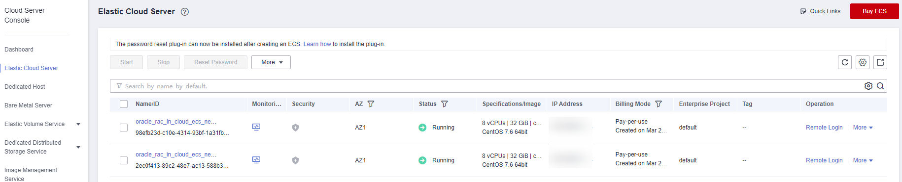
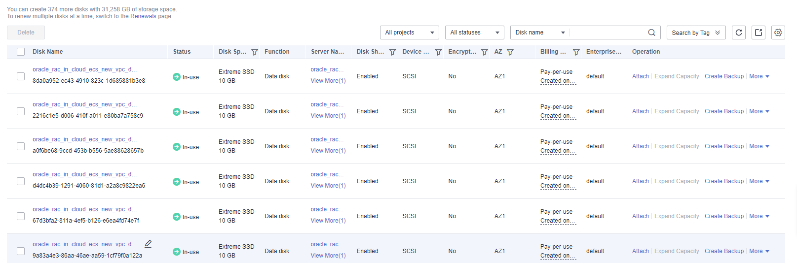

[TOC]

**Solution Overview**
===============
This solution enables you to easily deploy the basic environment for Oracle RAC. It helps speed up your digital transformation and provides a highly reliable and high-performance database service architecture. This solution applies to the following scenarios:

- Enterprises want to quickly launch services at low costs and require high performance and reliability.

- Enterprises want to migrate their data from Oracle databases to the cloud.

For more details about this solution, visit: https://www.huaweicloud.com/intl/en-us/solution/implementations/moracc.html

**Architecture**
---------------


**Architecture Description**
---------------
This solution will:
- Create two ECSs for deploying core database nodes.
- Attach two NICs to each ECS. One NIC is for public network communication and the other for private network communication.
- Create six shared SCSI EVS disks, three for OCR election, one for MGMTDB database, one for data disks, and the last one for flash disks.
- Attach the six shared SCSI EVS disks to the two core database nodes.
- Create three virtual IP addresses and bind them to the two core database nodes.

**File Structure**
---------------

``` lua
huaweicloud-solution-oracle-rac-in-cloud
├── oracle-rac-in-cloud-ecs.tf.json -- Resource orchestration template for ECSs and an existing VPC
├── oracle-rac-in-cloud-ecs-new-vpc.tf.json -- Resource orchestration template for ECSs and a new VPC
    ├── oracle_init.sh  -- Script configuration file
```
**Getting Started**
---------------

**Checking Resources**

1. Log in to the [ECS](https://console-intl.huaweicloud.com/ecm/?agencyId=WOmAijZnbElNjCFzTVDl4aJQAgdaTUMD&region=ap-southeast-3&locale=en-us#/ecs/manager/vmList) console and check the created ECSs.

	Figure 1 ECS console
	

2. Log in to the [EVS](https://console-intl.huaweicloud.com/ecm/?agencyId=WOmAijZnbElNjCFzTVDl4aJQAgdaTUMD&region=ap-southeast-3&locale=en-us#/evs/manager/volumelist) console and check the six shared disks you purchased.

	Figure 2 Logging in to the ECS console
	
